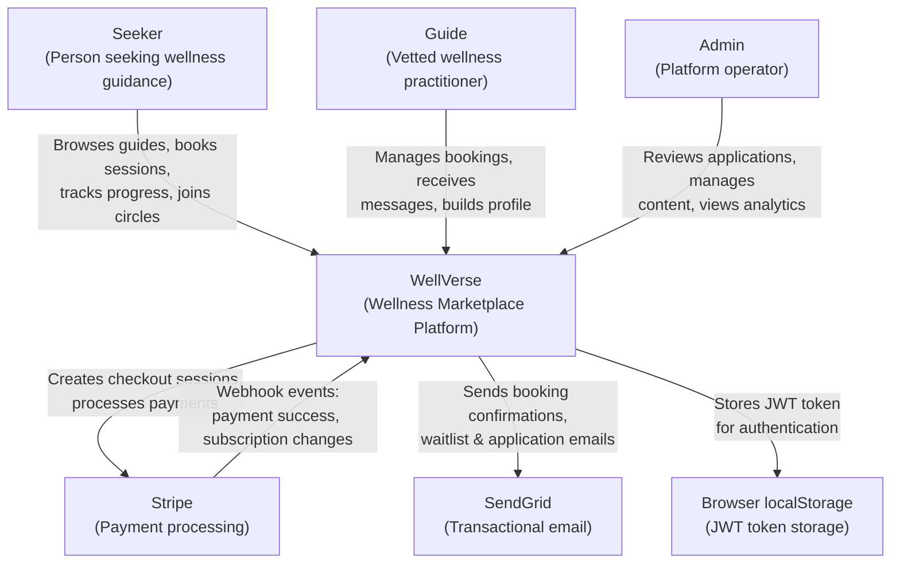
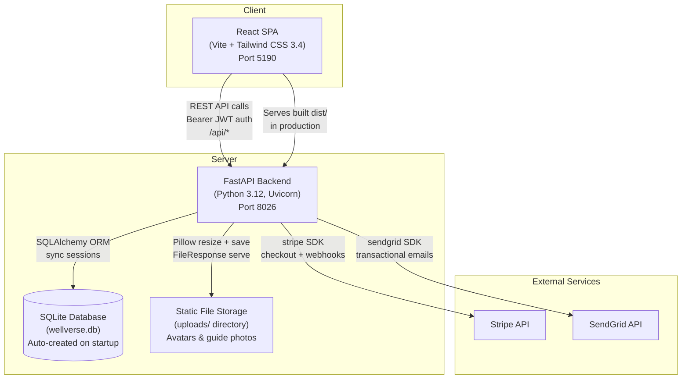
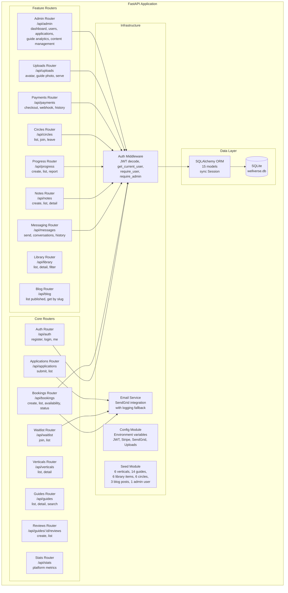
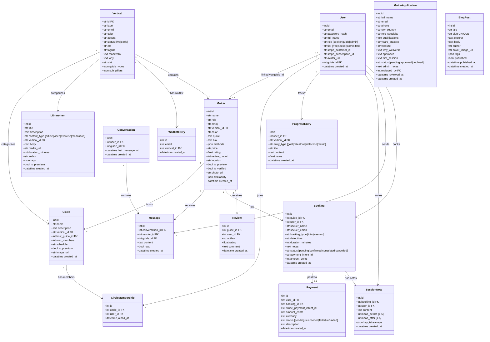

# WellVerse Architecture (C1-C4)

## C1 -- System Context

WellVerse is a vetted wellness marketplace connecting seekers with guides across six wellness verticals.

### External Actors

| Actor | Role | Interaction |
|-------|------|-------------|
| Seeker | End user seeking wellness guidance | Browse guides, book sessions, message guides, track progress, join circles |
| Guide | Vetted wellness practitioner | Receive bookings, respond to messages, manage availability |
| Admin | Platform operator | Review guide applications, manage library/circles/blog, view analytics |
| Stripe | Payment processor | Checkout sessions, payment intents, subscription management, webhooks |
| SendGrid | Email service | Waitlist confirmations, booking confirmations, application notifications |
| Browser | Client-side storage | JWT token persistence in localStorage |

---

## C2 -- Container Diagram

### Container Details

| Container | Technology | Purpose |
|-----------|-----------|---------|
| React SPA | React 18, Vite 6, Tailwind CSS 3.4, React Router 6 | Single-page application with 18 pages |
| FastAPI Backend | Python 3.12, FastAPI 0.115, Uvicorn 0.34, SQLAlchemy 2.0 | REST API with 17 routers + health endpoint |
| SQLite Database | SQLite via SQLAlchemy | Persistent storage, auto-created and seeded on first run |
| Static File Storage | Local filesystem (`uploads/`) | Avatar images (400x400) and guide photos (600x600) |
| Stripe API | Stripe SDK 11.4 | Payment intents, checkout sessions, subscription management |
| SendGrid API | SendGrid SDK 6.11 | Transactional emails (booking, waitlist, application notifications) |

---

## C3 -- Component Diagram (Backend)

### Component Inventory

| Component | Prefix | Endpoints | Auth Level |
|-----------|--------|-----------|------------|
| Auth | `/api/auth` | 4 | None (register/login), User (me) |
| Verticals | `/api/verticals` | 2 | None |
| Guides | `/api/guides` | 2 | None |
| Bookings | `/api/bookings` | 4 | Optional user / None |
| Reviews | `/api/guides/:id/reviews` | 2 | Optional user |
| Waitlist | `/api/waitlist` | 2 | None |
| Applications | `/api/applications` | 2 | None |
| Messaging | `/api/messages` | 3 | User |
| Notes | `/api/notes` | 3 | User |
| Progress | `/api/progress` | 3 | User |
| Library | `/api/library` | 2 | None |
| Circles | `/api/circles` | 3 | None (list), User (join/leave) |
| Payments | `/api/payments` | 3 | User (checkout/history), None (webhook) |
| Uploads | `/api/uploads` | 3 | User (upload), None (serve) |
| Admin | `/api/admin` | 8 | Admin |
| Blog | `/api/blog` | 2 | None |
| Stats | `/api/stats` | 1 | None |
| Health | `/api/health` | 1 | None |

---

## C4 -- Code Level

### Backend Entity Relationships

### Frontend Component Tree

```mermaid
graph TB
    App["App"]
    App --> AuthProvider["AuthProvider (Context)"]
    App --> Nav["Nav"]
    App --> Footer["Footer"]
    App --> GuideModal["GuideModal"]
    App --> GuidedTour["GuidedTour"]

    subgraph "Public Routes"
        Home["/ Home"]
        Explore["/explore Explore"]
        VD["/vertical/:id VerticalDetail"]
        Browse["/browse Browse"]
        ForGuides["/for-guides ForGuides"]
        Apply["/apply Apply"]
        SignIn["/signin SignIn"]
        Blog["/blog Blog"]
        BlogPost["/blog/:slug BlogPost"]
        Privacy["/privacy Privacy"]
        Terms["/terms Terms"]
    end

    subgraph "Authenticated Routes"
        Dashboard["/dashboard Dashboard"]
        Messages["/messages Messages"]
        Library["/library Library"]
        Circles["/circles Circles"]
        Settings["/settings Settings"]
    end

    subgraph "Admin Route"
        Admin["/admin Admin"]
    end

    App --> Home
    App --> Explore
    App --> VD
    App --> Browse
    App --> ForGuides
    App --> Apply
    App --> SignIn
    App --> Blog
    App --> BlogPost
    App --> Privacy
    App --> Terms
    App --> Dashboard
    App --> Messages
    App --> Library
    App --> Circles
    App --> Settings
    App --> Admin
```

### Design Token System

The frontend uses a custom color palette defined in `tokens.js`:

| Token | Hex | Usage |
|-------|-----|-------|
| void | `#0A0A08` | Page background |
| ink | `#111410` | Card backgrounds |
| ember | `#1A1A14` | Elevated surfaces |
| parchment | `#F2EDE4` | Primary text |
| dust | `#C4BAA8` | Secondary text |
| amber | `#C8923A` | Accent / CTA |
| gold | `#E2B96F` | Highlights |
| moss | `#3A5A40` | Fitness / Body vertical |
| sage | `#6A9E72` | Fitness accent |
| sky | `#4A7A9A` | Mental Wellness vertical |
| teal | `#2A6A60` | Brand / links |
| wine | `#6A2A40` | Relationships vertical |
| olive | `#5A7A2A` | Nutrition vertical |
| plum | `#5A3A6A` | Beauty vertical |
| indigo | `#2A3A7A` | Passion Circles vertical |

### Tier System

| Tier | Price | Key Limits |
|------|-------|-----------|
| Explorer (free) | Free forever | 1 circle, 1 intro call, browse only |
| Seeker | Pay per session | Unlimited bookings, messaging, notes, progress |
| Committed | $49/month | Unlimited circles, priority booking, 10% off sessions |
