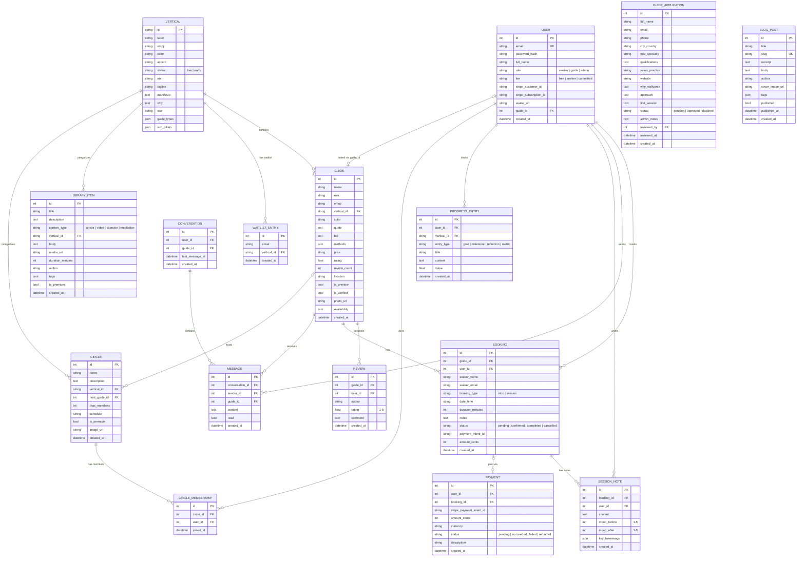

# WellVerse Domain Model

## Entity-Relationship Diagram

---

## Entity Details

### User

The central identity entity. A user can be a seeker (default), a guide (linked to a Guide record), or an admin.

| Attribute | Type | Rules |
|-----------|------|-------|
| email | string, unique, indexed | Must be unique; validated on registration |
| password_hash | string | bcrypt hash; minimum 6-character password enforced at registration |
| role | enum | `seeker` (default), `guide`, `admin` |
| tier | enum | `free` (default), `seeker` (pay-per-session), `committed` ($49/month) |
| stripe_customer_id | string, nullable | Created on first Stripe checkout |
| stripe_subscription_id | string, nullable | Set when Committed subscription activates; cleared on cancellation |
| guide_id | FK to Guide, nullable | Set when a guide application is approved, linking the user to their Guide record |
| avatar_url | string, nullable | Path to uploaded avatar image (max 400x400px) |

**Business Rules:**
- Roles are mutually exclusive (a user is exactly one of seeker/guide/admin)
- Tier upgrades happen via Stripe webhook (`checkout.session.completed`) or dev-mode fallback
- Tier downgrades happen via Stripe webhook (`customer.subscription.deleted`) -- tier resets to `free`
- Guide users are created automatically when an admin approves a GuideApplication

### Vertical

Represents one of the six wellness dimensions. Uses a string PK (e.g., `mind`, `body`, `nutrition`).

| Attribute | Type | Rules |
|-----------|------|-------|
| id | string PK | Slug identifier: `mind`, `body`, `nutrition`, `relationships`, `beauty`, `groups` |
| status | enum | `live` (bookable) or `early` (preview only, waitlist available) |
| eta | string, nullable | Expected launch date for `early` verticals (e.g., "Q3 2025") |
| guide_types | JSON array | List of practitioner categories within this vertical |
| sub_pillars | JSON array, nullable | Sub-categories (used by `relationships` vertical: Friendship + Romantic Love) |

**Business Rules:**
- Only `live` verticals have bookable (non-preview) guides
- `early` verticals show preview guides and collect waitlist entries
- Seeded with 6 verticals on first run (2 live, 4 early)

### Guide

A vetted wellness practitioner listed on the marketplace.

| Attribute | Type | Rules |
|-----------|------|-------|
| vertical_id | FK to Vertical | Every guide belongs to exactly one vertical |
| rating | float | Starts at 5.0; recalculated on every new review as mean of all review ratings |
| review_count | int | Incremented and recounted on every new review |
| is_preview | bool | `true` for guides in `early` verticals -- cannot be booked |
| is_verified | bool | Defaults to `true` for approved guides |
| availability | JSON, nullable | Array of `{day, slots[]}` objects defining bookable time slots |
| methods | JSON array | List of methodologies/techniques the guide uses |

**Business Rules:**
- Preview guides cannot be booked (HTTP 400)
- Rating is recalculated from all reviews on every new review submission
- Guides are created only through admin approval of a GuideApplication (never directly)
- Deleting a guide is admin-only

### Booking

Represents a scheduled session between a seeker and a guide.

| Attribute | Type | Rules |
|-----------|------|-------|
| booking_type | enum | `intro` (free 30-min) or `session` (paid 60-min) |
| date_time | string | ISO datetime string for the scheduled slot |
| duration_minutes | int | Auto-set: 30 for intro, 60 for session |
| status | enum | `pending` -> `confirmed` -> `completed` or `cancelled` |
| amount_cents | int, nullable | 0 for intro calls; guide's rate for sessions |
| payment_intent_id | string, nullable | Stripe PaymentIntent ID when payment is initiated |

**Business Rules:**
- **Conflict detection**: Cannot book a slot that already has a `pending` or `confirmed` booking for the same guide (HTTP 409)
- **Auto-confirm intros**: Intro calls are immediately set to `confirmed` status
- **Preview guard**: Cannot book preview guides (HTTP 400)
- Booking confirmation email sent via SendGrid (or logged in dev mode)
- User ID is optional -- unauthenticated bookings are allowed

### Review

User-submitted rating and comment for a guide.

| Attribute | Type | Rules |
|-----------|------|-------|
| rating | float | Must be between 1.0 and 5.0 (validated server-side) |
| user_id | FK, nullable | Optional -- unauthenticated reviews allowed |
| author | string | Display name of the reviewer |

**Business Rules:**
- On every new review, the guide's `rating` is recalculated as the mean of all review ratings
- The guide's `review_count` is updated to the total count of reviews
- No duplicate review prevention (a user can review the same guide multiple times)

### WaitlistEntry

Captures interest in an `early`-status vertical.

| Attribute | Type | Rules |
|-----------|------|-------|
| email | string | The subscriber's email |
| vertical_id | FK to Vertical | Which vertical they are interested in |

**Business Rules:**
- **Deduplication**: If the same email + vertical_id combination exists, the existing entry is returned (no duplicate created)
- Confirmation email sent via SendGrid on new entry

### GuideApplication

A practitioner's application to join the platform.

| Attribute | Type | Rules |
|-----------|------|-------|
| status | enum | `pending` (default), `approved`, `declined` |
| reviewed_by | FK to User, nullable | Admin user who reviewed the application |
| reviewed_at | datetime, nullable | Timestamp of review decision |

**Business Rules:**
- Required fields: `full_name`, `email`, `role_specialty` (validated server-side)
- On **approval**, the system automatically:
  1. Creates a new Guide record with details from the application + admin-provided metadata
  2. Creates a new User account (role=`guide`, password=`welcome123`) or upgrades an existing user to `guide` role
  3. Links the User to the Guide via `guide_id`
- On **decline**, no side effects beyond status update
- Application received email sent via SendGrid on submission

### Conversation + Message

One-to-one messaging between a seeker and a guide.

**Conversation:**
- One conversation per user-guide pair (created on first message)
- `last_message_at` updated on every new message

**Message:**
- `read` defaults to `false`; set to `true` when the recipient fetches the conversation
- Messages are ordered by `created_at` ascending within a conversation
- Unread count calculated per conversation for the conversation list

### SessionNote

Post-session reflection attached to a booking.

| Attribute | Type | Rules |
|-----------|------|-------|
| mood_before | int, nullable | 1-5 scale |
| mood_after | int, nullable | 1-5 scale |
| key_takeaways | JSON array, nullable | List of takeaway strings |

**Business Rules:**
- Must reference a valid booking
- Mood improvement is calculated in the progress report as `avg(mood_after - mood_before)`
- Notes are user-scoped (a user can only see their own notes)

### ProgressEntry

User-created tracking entries for wellness goals.

| Attribute | Type | Rules |
|-----------|------|-------|
| entry_type | enum | `goal`, `milestone`, `reflection`, `metric` |
| value | float, nullable | Numeric value for `metric` entries |
| vertical_id | FK, nullable | Optional vertical association |

**Business Rules:**
- Progress report aggregates: total bookings, completed sessions, total notes, avg mood improvement, goals, milestones, recent 10 entries

### LibraryItem

Curated wellness content created by admins.

| Attribute | Type | Rules |
|-----------|------|-------|
| content_type | enum | `article`, `video`, `exercise`, `meditation` |
| body | text, nullable | Markdown content for articles |
| is_premium | bool | Premium items restricted to paid tiers |

**Business Rules:**
- Filterable by vertical, content type, and search term (title/description)
- Created exclusively via the admin router
- Seeded with 6 items on first run

### Circle + CircleMembership

Community groups with membership limits.

**Circle:**
- `max_members`: capacity limit (enforced on join)
- `is_premium`: requires Seeker or Committed tier
- `host_guide_id`: optional guide who hosts the circle

**Business Rules:**
- **Free tier limit**: Free users can join at most 1 circle
- **Premium gate**: Premium circles require `seeker` or `committed` tier (HTTP 403)
- **Capacity check**: Cannot join a full circle (HTTP 400)
- **Duplicate prevention**: Cannot join a circle twice (HTTP 400)
- Seeded with 6 circles on first run

### Payment

Records of financial transactions.

| Attribute | Type | Rules |
|-----------|------|-------|
| status | enum | `pending`, `succeeded`, `failed`, `refunded` |
| currency | string | Defaults to `usd` |

**Business Rules:**
- In dev mode (no Stripe key), payments are simulated: booking auto-confirmed, Payment record created with `amount_cents=0`
- In production, Payment records are created by the Stripe webhook handler on `payment_intent.succeeded`
- Payment history is user-scoped

### BlogPost

Content marketing articles.

| Attribute | Type | Rules |
|-----------|------|-------|
| slug | string, unique | URL-safe identifier for routing |
| published | bool | Only published posts appear in the public listing |
| published_at | datetime, nullable | Set when post is published |

**Business Rules:**
- Public endpoints only return `published=True` posts
- Slug must be unique (HTTP 400 on duplicate)
- Created exclusively via the admin router
- Seeded with 3 posts on first run
